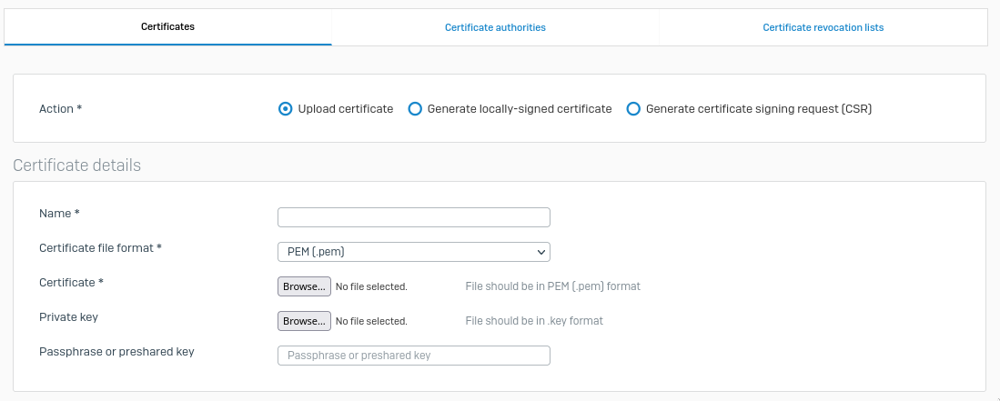

# Sophos Firewall Certificate Uploader

This repository offers a Python script that uploads or updates a certificate on a sophos firewall by interacting with its API.
It reads necessary information, such as firewall credentials and certificate details, from environment variables and sends a POST request to the firewall API to either update or add the specified certificate.



## Prerequisites
1. Linux machine
2. Python 3.9 or later
3. [`poetry`](https://python-poetry.org/) 1.4 or later

## Installation
1. Clone the repository
    ```bash
    git clone https://github.com/tiqi-group/sophos-firewall-certificate-uploader.git
    ```

2. Install the required dependencies with `poetry`
    ```bash
    poetry install
    ```

## Configuration
Create an `.env` file in the project's root directory with the following environment variables:
```ini
FIREWALL_API_ADMIN=...
FIREWALL_API_ADMIN_PWD=...
FIREWALL_DOMAIN_AND_PORT=...
CERTIFICATE_PATH=...
CERTIFICATE_NAME=...
CERTIFICATE_PWD=... (optional)
VERIFY_SSL_CERTIFICATE=... (optional, default is False)
```
or export those variables in your environment.

Replace the placeholders with your actual values.
- `FIREWALL_API_ADMIN`: your firewall admin username
- `FIREWALL_API_ADMIN_PWD`: your firewall admin password
- `FIREWALL_DOMAIN_AND_PORT`: your firewall domain and port
  - e.g. `firewall.example.com:4444` or `10.2.0.1:4444`
- `CERTIFICATE_PATH`: absolute path to your certificate file
- `CERTIFICATE_NAME`: name of the certificate on the firewall
- `CERTIFICATE_PWD`: certificate passphrase or preshared key (optional)
- `VERIFY_SSL_CERTIFICATE`: set to True or 1 to enable SSL certificate verification for the API request

**Note** that using SSL certificate verification is strongly advised as you are passing passwords in the http request.

## Usage

After configuring the .env file, run the script as follows:
```bash
[sudo] .venv/bin/python certificate_uploader.py
```
Depending on what user you execute the command with, you might need to add `sudo` if the path of the certificate need elevated privileges.

The script will first try to update the certificate with the specified name on the firewall. If the certificate name is not defined yet, the script will add the certificate to the firewall.

The `loguru` logger is used to log important events, errors, and debugging information. You can customize the logger configuration as needed.

## License

This project is licensed under the [MIT License](./LICENSE).